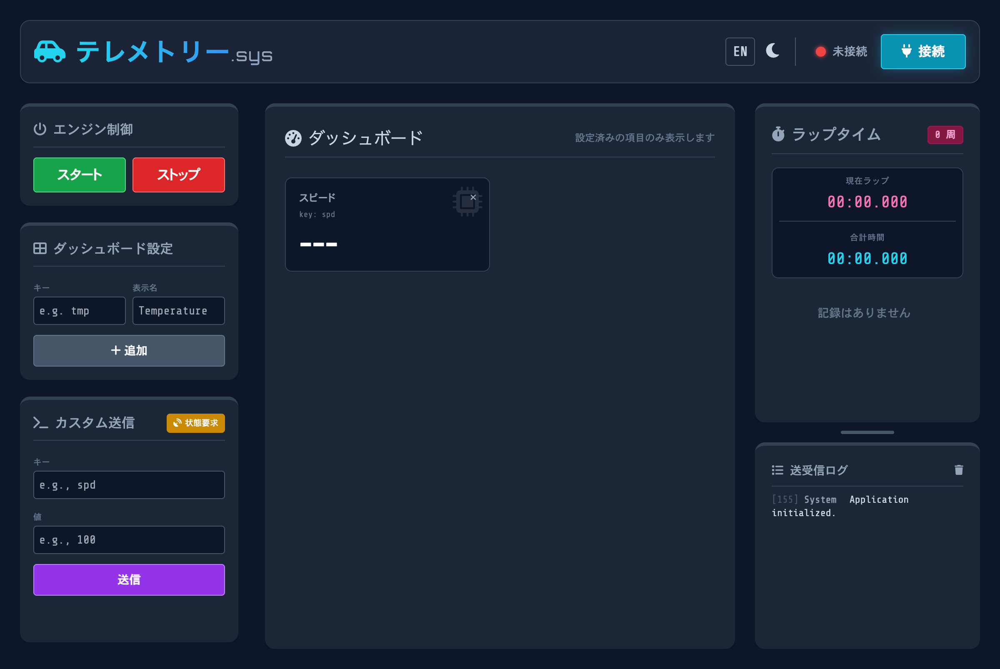
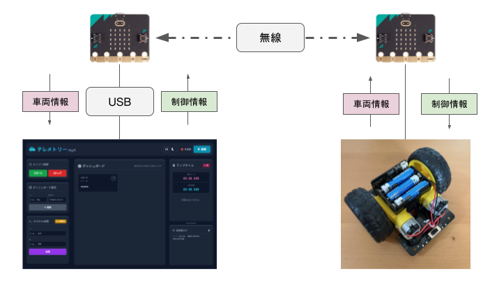
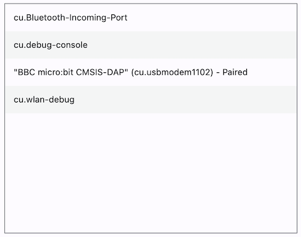
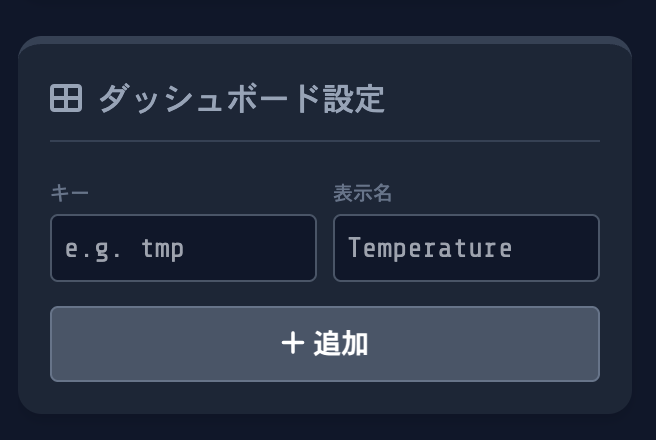
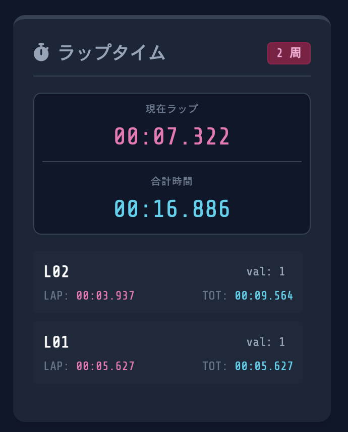
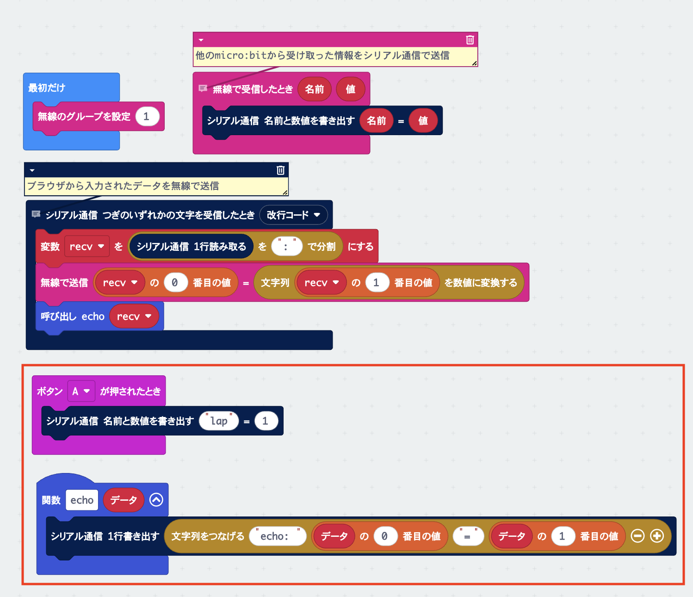

# Telemetry System

このシステムは、micro:bitで制御する車の情報を取得したり制御情報を送るためのwebシステムです。

[Telemetry System](https://kwaka1208.github.io/microbit/telemetry/)

## システム図

下の図のように2つのmicro:bitをそれぞれPCと車に接続し、micro:bitを経由して情報をやり取りして、車の制御や情報の取得ができます。

## 動作環境

* ブラウザ: Google Chrome または Microsoft Edge (Web Serial APIに対応している必要があります)  
* ハードウェア: micro:bit (USBケーブルでPCに接続)

## Webシステムの使い方

### 1. 接続 (CONNECT)

1. micro:bitをUSBケーブルでPCに接続します。  
2. 画面右上の「CONNECT（接続）」ボタンをクリックします。  
3. ブラウザのポップアップが表示されるので、「mbed Serial Port」または「BBC micro:bit CMSIS-DAP」などを選択して「接続」を押します。  
4. 接続に成功するとステータスが「CONNECTED」になり、LEDアイコンが緑色に点灯します。

接続ボタン

ポップアップの表示（内容はPCによって異なります）

接続完了後

### 2. ダッシュボード設定 (DASHBOARD CONFIG)

受信したデータを画面中央のメーターとして表示するためには、あらかじめ項目を登録しておく必要があります。（デフォルトでspdが登録されています）

1. 左側の「DASHBOARD CONFIG」パネルの KEY (RX) に、micro:bitから送られてくるデータのキー名（例: tmp）を入力します。  
2. DISPLAY NAME に、画面に表示したい名前（例: 温度）を入力します。  
3. 「ADD ITEM（追加）」ボタンを押します。

### 3. エンジン制御とラップタイム (ENGINE & LAPS)

1. 「START」ボタンを押すと内部のタイマーが動き出し、計測（セッション）が開始されます。同時にmicro:bitに eng:1 が送信されます。  
2. micro:bitから lap:任意の値 というデータを受信すると、その時点のラップタイムと合計時間が右側の「LAP TIMES」パネルに記録されます。  
3. 「STOP」ボタンでタイマーが停止し、micro:bitに eng:0 が送信されます。（再度STARTを押すとリセットされます）

## micro:bit側のプログラム作成方法

ブラウザとmicro:bitは、改行コード(\\n)区切りの文字列で通信します。

フォーマットは常に キー:値 の形式です。

### 通信プロトコル（仕様）

| 方向 | フォーマット | 説明 |
|:--:|:--:|:--|
| PC → micro:bit | eng:1 | エンジンスタート（計測開始） |
| PC → micro:bit | eng:0 | エンジンストップ（計測終了） |
| PC → micro:bit | inq:0 | 現在の全ステータスを要求（定義のみ、機能は実装されていません） |
| micro:bit → PC | lap:\<数値\> | ラップ通過を通知（値は任意の数値, 例: lap:1） |
| micro:bit → PC | \<キー\>:\<数値\> | カスタムデータ（例: spd:50, tmp:26 など。キーは基本的に3文字） |

## MakeCodeでの利用例

### PC（テレメントリーシステム）側

[PC側：telementry-client](https://makecode.microbit.org/S67601-05149-79223-33048)

車側のmicro:bitとデータの送受信を行います

- 車側のmicro:bitから受け取ったデータをブラウザにシリアル通信で送る
- ブラウザで入力されたデータをシリアル通信で受け取り、無線で送る

赤枠の部分は動作確認に使うための処理です。Aボタンを押すと`lap:1`が送られた時と同じ動作を行います。

### 2. 車側

[車側：cat-control]()

PC（テレメントリーシステム）からエンジンスタート`eng:1`を受け取ったらスタートします。

*(ここにMakeCodeのブロックを組んだ画面のスクリーンショットを追加)*

## 開発のヒント

* カスタムコマンド: Web画面左下の「CUSTOM CMD」を使うと、任意のキーと値を手動でmicro:bitに送ることができます。プログラムのデバッグ時に便利です。  
* 送受信ログ: 画面右下の「TX/RX LOG」には、実際のシリアル通信の生データが流れます。想定通りに文字が送受信できているかここで確認してください。

これをベースに独自の機能を作り込んでみてください。
